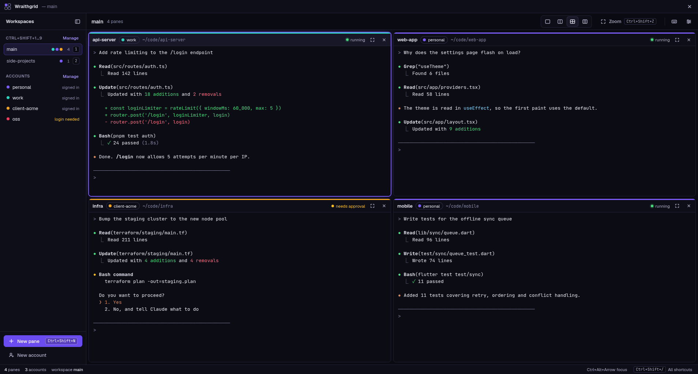
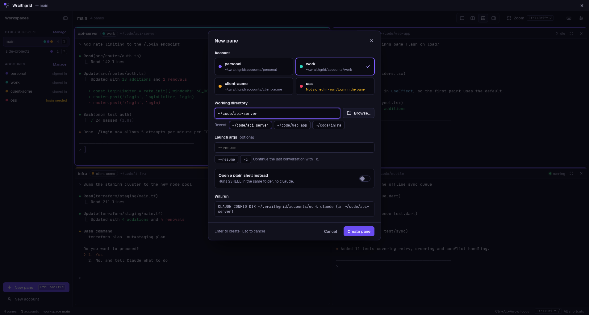
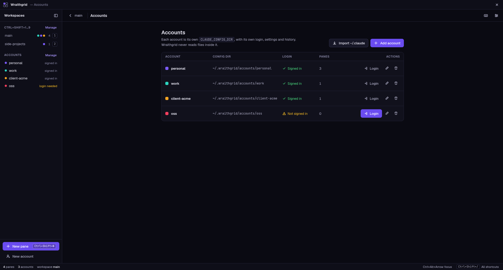
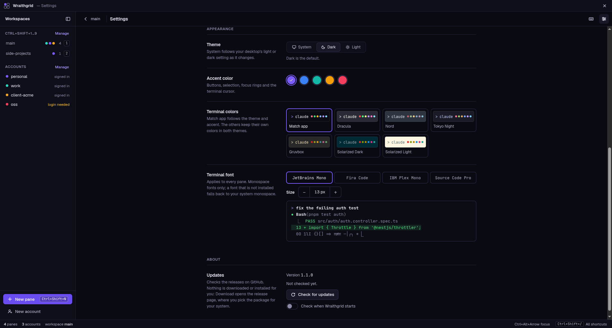
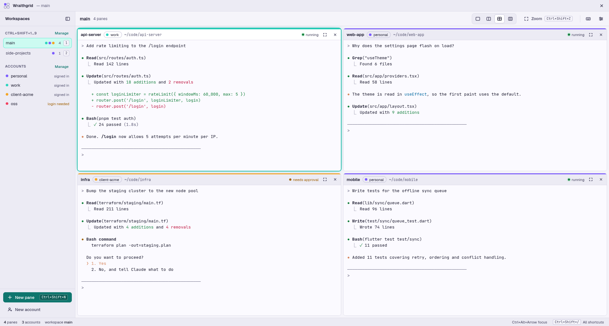

<div align="center">


# Wraithgrid

**Run many `claude` CLI sessions side by side, each with its own account and project folder.**

[](https://github.com/cachewraith/wraithgrid/releases/latest)
[](https://github.com/cachewraith/wraithgrid/actions/workflows/build.yml)
[](#install)
[](LICENSE)

[Install](#install) · [Usage](#usage) · [Shortcuts](#shortcuts) · [Build from source](#build-from-source) · [Privacy](#privacy-and-security)

</div>

<br />

<picture>
  <source media="(prefers-color-scheme: light)" srcset="docs/screenshots/grid-light.png" />
  
</picture>

## Why Wraithgrid

Switching `claude` accounts normally means logging out and back in. Wraithgrid removes that
step: every pane has its own account and its own project folder, and all of them run at the
same time in one window.

It runs the official `claude` CLI as-is. For each pane it sets `CLAUDE_CONFIG_DIR` to that
account's folder, so every account keeps its own login, settings and history. Wraithgrid never
reads, copies or proxies anything inside those folders.

## Features

|                               |                                                                                                              |
| ----------------------------- | ------------------------------------------------------------------------------------------------------------ |
| **Many accounts at once**     | Personal, work and client accounts run side by side, each with its own login, settings and history.          |
| **Flexible layouts**          | 1, 2 side by side, 2×2 or 3 columns. Drag dividers to resize, drag headers to swap, zoom any pane.           |
| **Workspaces**                | Keep separate sets of panes and switch between them with `Ctrl+Shift+1…9`.                                   |
| **Live pane status**          | Each pane shows whether `claude` is running, idle or waiting for your approval.                              |
| **Shared CLAUDE.md & skills** | Optionally link one `CLAUDE.md` and one `skills/` folder into every account.                                 |
| **Survives restarts**         | Workspaces, layouts, accounts and folders come back on the next launch.                                      |
| **Themes**                    | Dark, light or system, five accent colors, and terminal palettes such as Dracula, Nord and Tokyo Night.      |
| **Native everywhere**         | Windows 10/11 and Linux (Ubuntu, Debian, Kali, Fedora, Arch) on X11 or Wayland, including Hyprland and sway. |
| **Private by design**         | No telemetry. The renderer is sandboxed and reaches the system only through a validated IPC surface.         |

## Screenshots

<table>
  <tr>
    <td width="50%">
      
      <p align="center"><b>New pane</b>: pick an account, a folder and launch args</p>
    </td>
    <td width="50%">
      
      <p align="center"><b>Accounts</b>: one <code>CLAUDE_CONFIG_DIR</code> per account</p>
    </td>
  </tr>
  <tr>
    <td width="50%">
      
      <p align="center"><b>Appearance</b>: theme, accent, terminal colors and font</p>
    </td>
    <td width="50%">
      
      <p align="center"><b>Light theme</b>, teal accent</p>
    </td>
  </tr>
</table>

## Install

Download the package for your system from the
[latest release](https://github.com/cachewraith/wraithgrid/releases/latest), or
[build one yourself](#build-from-source).

| System                          | Package                                                      |
| ------------------------------- | ------------------------------------------------------------ |
| Ubuntu 22.04+, Debian 12+, Kali | `sudo apt install ./wraithgrid-<version>-amd64.deb`          |
| Fedora                          | `sudo dnf install ./wraithgrid-<version>-x86_64.rpm`         |
| Arch (and Hyprland on Arch)     | `sudo pacman -U ./wraithgrid-<version>-x64.pacman`           |
| Any Linux distro                | `chmod +x Wraithgrid-<version>-x86_64.AppImage`, then run it |
| Windows 10 (1809+) and 11       | `Wraithgrid-Setup-<version>-x64.exe`                         |

Every release includes a `SHA256SUMS.txt` for verifying downloads.

> [!NOTE]
> You also need the [`claude` CLI](https://docs.claude.com/en/docs/claude-code). Wraithgrid
> finds it on your `PATH` (including the native installer's `~/.local/bin` and npm's global
> folder). You can also set its path in **Settings**.

<details>
<summary><b>Platform notes</b>: tiling compositors, launchers, AppImage, Windows</summary>

<br />

- **Hyprland, sway, i3 and other tiling compositors.** Wraithgrid detects them. The title bar
  then only has a close button, since the compositor owns sizing and there is no minimize, and
  the minimum window size drops to 640×420 so the window fits a tile. It runs as a native
  Wayland client with the app id `wraithgrid`, for window rules such as:
  ```ini
  windowrulev2 = workspace 3, class:^(wraithgrid)$
  ```
- **Started from a launcher.** A Hyprland `exec`, a `.desktop` entry or a dock often starts apps
  without your shell's `PATH`. Wraithgrid then asks your login shell for it once at startup
  (like VS Code does), so `claude`, `node` and the tools `claude` runs are found. Your shell rc
  can check `WRAITHGRID_RESOLVING_ENVIRONMENT=1` to skip slow setup during that call.
- **AppImage on Ubuntu 24.04+ and Kali.** AppArmor blocks the Chromium sandbox of unpackaged
  apps, so prefer the `.deb`, which installs an AppArmor profile. The AppImage also needs
  FUSE 2 (`libfuse2t64` on Ubuntu 24.04, `libfuse2` on Debian/Kali, `fuse-libs` on Fedora,
  `fuse2` on Arch).
- **Don't run it as root** (for example an old Kali root session). Chromium refuses to start as
  root without `--no-sandbox`, and turning the sandbox off is not recommended.
- **Windows.** Plain shell panes use PowerShell 7 (`pwsh`), then Windows PowerShell, then
  `cmd`. The native caption buttons (with snap layouts) sit on the title bar. An npm-installed
  `claude` (`claude.cmd`) runs through `cmd.exe`, so launch args containing `& | < > ^ % "` are
  refused; the native `claude.exe` has no such limit.
- **Where files live.** Config is in `~/.config/wraithgrid/config.json` on Linux and
  `%APPDATA%\wraithgrid\config.json` on Windows. Account folders default to
  `~/.wraithgrid/accounts/` (`%USERPROFILE%\.wraithgrid\accounts\` on Windows).

</details>

## Usage

1. **Add accounts.** Open **Accounts** (sidebar, **Manage**).
   - **Add account** creates `~/.wraithgrid/accounts/<name>` for a fresh login.
   - **Import ~/.claude** points an account at an existing config dir so you keep that login.
     Nothing is copied.
2. **Sign in.** Press **Login** on an account. A pane opens running `claude` under that
   account. Press **Run /login** and finish in your browser. The account shows as signed in
   once the pane prints a successful login, or when you press **Mark as signed in**.
3. **Open panes.** Press **New pane** (`Ctrl+Shift+N`) and pick an account, a folder and
   optional launch args (`--resume`, `-c`). You can also open a plain shell in a folder.
4. **Arrange them.**
   - Drag the dividers to resize.
   - Pick a preset: 1, 2 side by side, 2×2, or 3 columns.
   - Drag a pane by its header onto another pane to swap them.
   - Zoom a pane with `Ctrl+Shift+Z`.
   - Panes that don't fit a preset stay open but hidden. The **+N hidden** chip brings them
     back.
5. **Workspaces.** Keep separate sets of panes (the sidebar, or **Manage** to create, rename
   and delete them) and switch with `Ctrl+Shift+1…9`.
6. **Share one CLAUDE.md and one set of skills.** Each account normally has its own
   `CLAUDE.md` and `skills/`, because they live in its config dir. In **Settings → Shared
   CLAUDE.md and skills**, pick the account that holds the real ones. Every other account then
   gets links to them. Logins, settings and history stay separate per account.
   - An account's own `CLAUDE.md` or `skills/` is not deleted: it is renamed to
     `CLAUDE.md.wraithgrid-backup` / `skills.wraithgrid-backup`, and put back when you pick
     **Off**.
   - Accounts added later are linked the first time a pane starts for them.
   - On Windows, `skills` is a junction. `CLAUDE.md` is a symlink with Developer Mode on,
     otherwise a hard link. Editors that save by replacing the file break a hard link, so edit
     `CLAUDE.md` in the source account.

When `claude` exits, the pane stays open with the exit code and last error line, and a
**Restart** button. Quitting Wraithgrid ends every pane's processes. On the next launch your
workspaces, layouts, accounts and folders come back and each pane starts `claude` again.
Conversation history belongs to `claude` itself: add `-c` to a pane's launch args to continue
where you left off.

### Shortcuts

| Action                              | Keys                 |
| ----------------------------------- | -------------------- |
| New pane                            | `Ctrl+Shift+N`       |
| Close pane                          | `Ctrl+Shift+W`       |
| Zoom pane / back to grid            | `Ctrl+Shift+Z`       |
| Move focus left / up / right / down | `Ctrl+Alt+Arrow`     |
| Switch workspace                    | `Ctrl+Shift+1` … `9` |
| Copy / paste in a terminal          | `Ctrl+Shift+C` / `V` |
| All shortcuts                       | `Ctrl+Shift+/`       |
| Close a dialog                      | `Esc`                |

Every other key, including `Ctrl+C`, `Esc` and the arrow keys, goes to the terminal.

## Configuration

Settings, accounts and workspaces live in `config.json` (see
[Platform notes](#install) for the path). Changes are saved automatically. If the file is ever
unreadable, Wraithgrid moves it to `config.bad-<timestamp>.json` and starts fresh. Wraithgrid
never saves terminal content.

**Settings** covers:

- the `claude` binary: auto-detected from `PATH`, with an optional override
- the default account and the default working directory
- shared `CLAUDE.md` and skills
- theme (dark, light or system), accent color and terminal color palette
- the terminal font and size
- update checks against GitHub releases (nothing is downloaded or installed for you)

## Privacy and security

- **No telemetry.** The only network activity is opening links you click, in your browser
  (http and https only), and the optional release check, which you can turn off.
- **Sandboxed renderer.** The UI runs sandboxed with context isolation. It reaches the system
  only through a fixed, validated IPC surface.
- **Account folders are off-limits.** Sharing CLAUDE.md and skills is opt-in. It is the only
  time Wraithgrid writes into account config dirs, and it only places links and renames what
  was in the way. It never reads the files.
- **Guarded deletes.** Deleting an account's config dir is opt-in, needs confirmation, and only
  works on the folder that account points to inside your home directory.

## Build from source

**Requirements**

- Node.js 22.12 or newer, and pnpm 11 (`corepack enable` picks the pinned version)
- A C++ toolchain for the `node-pty` native module:
  - Arch: `sudo pacman -S --needed python make gcc`
  - Ubuntu, Debian, Kali: `sudo apt install python3 make g++`
  - Fedora: `sudo dnf install python3 make gcc-c++`
  - Windows: Visual Studio Build Tools with "Desktop development with C++", and Python 3
- To build a Fedora `.rpm` on another distro: `rpmbuild` (`rpm-tools` on Arch, `rpm` on
  Ubuntu). The pacman package needs `bsdtar` (`libarchive-tools` on Ubuntu).

```sh
pnpm i                      # installs deps and rebuilds node-pty for Electron
pnpm dev                    # run with hot reload
pnpm dist:linux:portable    # all Linux packages, built in Docker on Ubuntu 22.04
pnpm dist:win               # Windows installer (run on Windows)
```

If `pnpm i` asks you to approve build scripts, allow `electron`, `esbuild` and `node-pty`. The
repository's `pnpm-workspace.yaml` already lists them under `allowBuilds`.

<details>
<summary><b>Why the portable build?</b></summary>

<br />

`node-pty` compiles against the build machine's glibc. A package built on a rolling distro
(Arch, current Fedora) only runs on distros at least as new. `dist:linux:portable` builds on
Ubuntu 22.04 (glibc 2.35) inside Docker, so one set of packages runs on Ubuntu 22.04+,
Debian 12+, Kali, Fedora and Arch. `scripts/test-linux-packages.sh` then installs each package
in clean containers of those distros and checks it starts. The GitHub Actions workflow in
`.github/workflows/build.yml` does the same builds, plus the Windows installer on a Windows
runner.

</details>

<details>
<summary><b>All scripts</b></summary>

<br />

| Script                     | What it does                                                |
| -------------------------- | ----------------------------------------------------------- |
| `pnpm dev`                 | electron-vite dev server with the app                       |
| `pnpm build`               | production build into `out/`                                |
| `pnpm typecheck`           | `tsc` over the main/preload and renderer projects           |
| `pnpm lint`                | ESLint and a Prettier check                                 |
| `pnpm test`                | Vitest unit tests                                           |
| `pnpm test:e2e`            | builds, then runs the Playwright Electron smoke test        |
| `pnpm dist`                | packages for the current OS                                 |
| `pnpm dist:linux`          | AppImage, .deb, .rpm and pacman package, on this machine    |
| `pnpm dist:linux:portable` | the same, built in an Ubuntu 22.04 container (needs Docker) |
| `pnpm dist:win`            | NSIS installer for Windows                                  |

</details>

<details>
<summary><b>Releasing</b></summary>

<br />

Pushing a version tag publishes a GitHub release (`.github/workflows/release.yml`). The
workflow checks that the tag matches `package.json`, runs the tests, builds the Linux packages
(on Ubuntu 22.04) and the Windows installer, then attaches all of them and a
`SHA256SUMS.txt` to the release.

```sh
npm version patch -m "chore: release %s"   # or minor / major; bumps package.json, commits, tags v1.0.1
git push --follow-tags
```

A tag with a suffix, such as `v1.1.0-beta.1`, is published as a pre-release.

</details>

## License

[MIT](LICENSE) © cachewraith
